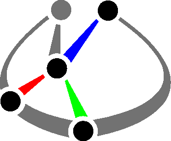

<p align="center">
  
</p>

# spatial-casadi

[](https://github.com/psf/black)

This package implements various data structures and helper methods for manipulating spatial transformations using [CasADi](https://web.casadi.org/) variables in Python.
The library interface is partially based on the [Scipy spatial module](https://docs.scipy.org/doc/scipy/reference/spatial.html).


- Code: [https://github.com/cmower/spatial-casadi](https://github.com/cmower/spatial-casadi)
- Documentation: [https://cmower.github.io/spatial-casadi/](https://cmower.github.io/spatial-casadi/)
- PyPI: [https://pypi.org/project/spatial-casadi/1.0.0/](https://pypi.org/project/spatial-casadi/1.0.0/)
- Issues: [https://github.com/cmower/spatial-casadi/issues](https://github.com/cmower/spatial-casadi/issues)

# Examples

There are three main data structures: [Rotation](https://cmower.github.io/spatial-casadi/classspatial__casadi_1_1spatial_1_1Rotation.html), [Translation](https://cmower.github.io/spatial-casadi/classspatial__casadi_1_1spatial_1_1Translation.html), and [Transformation](https://cmower.github.io/spatial-casadi/classspatial__casadi_1_1spatial_1_1Transformation.html).
The following showcases some of the main functionality of the library.

```
>>> import spatial_casadi as sc
>>> import casadi as cs
>>> euler = cs.SX.sym("euler", 3)
>>> sc.Rotation.from_euler('xyz', euler).as_quat()
SX(@1=2, @2=cos((x_2/@1)), @3=cos((x_1/@1)), @4=sin((x_0/@1)), @5=(@3*@4), @6=sin((x_2/@1)), @7=cos((x_0/@1)), @8=sin((x_1/@1)), @9=(@7*@8), @10=(@3*@7), @11=(@8*@4), [((@2*@5)-(@6*@9)), ((@2*@9)+(@6*@5)), ((@10*@6)-(@2*@11)), ((@2*@10)+(@6*@11))])
>>> r = sc.Rotation.random()
>>> r.as_quat()
DM([-0.172177, 0.248674, 0.642138, -0.704397])
>>> r.as_rotvec()
DM([0.403149, -0.582264, -1.50355])
>>> r.as_matrix()
DM(
[[0.0516394, 0.819008, -0.571453],
 [-0.990272, 0.116026, 0.0768034],
 [0.129206, 0.561928, 0.817033]])
>>> r.as_euler('xyz')
DM([0.602468, -0.129568, -1.5187])
>>> r.as_mrp()
DM([0.10102, -0.145901, -0.376754])
>>> sc.Rotation.from_euler('x', 90, degrees=True).as_matrix()
DM(
[[1, 0, 0],
 [0, 2.22045e-16, -1],
 [0, 1, 2.22045e-16]])
>>> r1.as_quat()
DM([0.192977, 0.820457, 0.443494, -0.304832])
>>> r2.as_quat()
DM([-0.671078, -0.129029, 0.686258, 0.24911])
>>> (r1 * r2).as_quat()
DM([0.872907, -0.186335, 0.426977, -0.144922])
```

# Install

## From PyPI

```shell
$ pip install spatial-casadi
$ pip install spatial-casadi[test] # if you want to run the test scripts
```

## From source

In a new terminal:
1. Clone repository:
   - (ssh) `$ git clone git@github.com:cmower/spatial-casadi.git`, or
   - (https) `$ git clone https://github.com/cmower/spatial-casadi.git`
2. Change directory: `$ cd spatial-casadi`
3. Ensure `pip` is up-to-date: `$ python -m pip install --upgrade pip`
3. Install from source:
   - (main library) `$ pip install .`
   - (when you want to also run the test scripts) `$ pip install .[test]`

# Running the test scripts

1. Install `spatial-casadi` from source and ensure you install the `test` packages (see previous section).
2. Change directory: `$ cd /path/to/spatial-casadi`
3. Run tests: `pytest`

# Build documentation

In a new terminal:
1. Clone repository:
   - (ssh) `$ git clone git@github.com:cmower/spatial-casadi.git`, or
   - (https) `$ git clone https://github.com/cmower/spatial-casadi.git`
2. Change directory: `$ cd spatial-casadi/doc`
3. Install doxygen: `$ sudo apt install doxygen`
4. Build documentation: `$ doxygen`
5. View documentation:
   - In a browser, open `html/index.html`
   - Build pdf (requires LaTeX)
	 - `$ cd latex`
	 - `$ make`
	 - Open the file called `refman.pdf`

# Citing

If you use `spatial-casadi` in your work, please consider citing the following.

```bibtex
@software{Mower2023
  title = "Spatial CasADi: A Compact Library for Manipulating Spatial Transformations",
  author = "Christopher E. Mower",
  year = "2023",
  url = {https://github.com/cmower/spatial-casadi},
}
```

# Contributing

If you have any issues with the library, or find inaccuracies in the documentation please [raise an issue](https://github.com/cmower/spatial-casadi/issues/new/choose).
I am happy to consider new features if you [fork the library](https://github.com/cmower/spatial-casadi/fork) and submit a pull request.
